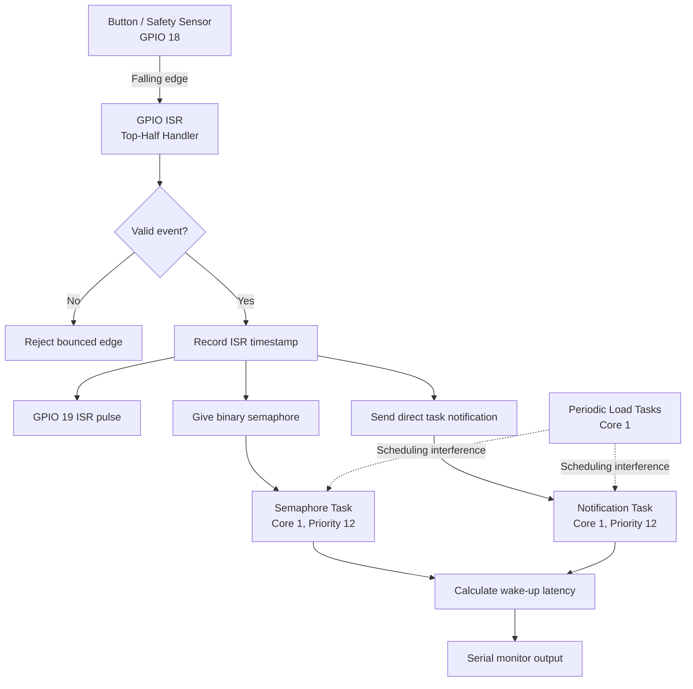

[README.md](https://github.com/user-attachments/files/30367003/README.md)
# GIRON-FINAL-RTS26Summer
This project evaluates interrupt-to-task response latency on an ESP32 using FreeRTOS. It compares direct task notifications and binary semaphores under idle and processor-load conditions to demonstrate how scheduling interference affects real-time responsiveness and jitter.

# Real-Time Industrial Interrupt Response System

## Overview

This project demonstrates the **top-half/bottom-half interrupt-handling pattern** using FreeRTOS on an ESP32. It compares two methods of signaling a task from a hardware interrupt:

- Direct-to-task notification
- Binary semaphore

The system measures interrupt-to-task wake-up latency under both idle and CPU-loaded conditions. It also includes an induced ISR scheduling failure to demonstrate how removing an immediate scheduler yield affects timing predictability.

The project is themed as an **industrial safety-event handler**, where a button represents a sensor, interlock, emergency stop, or other time-sensitive industrial input.

## Project Links

- **Wokwi Simulation:** [Open the project in Wokwi](https://wokwi.com/projects/468090864442174465)
- **GitHub Pages:** [View the project site](https://xyzalaxel.github.io/GIRON-FINAL-RTS26Summer/)
- **Demo Video:** `ADD_VIDEO_URL`

---

## Technical Objectives

This project demonstrates the following real-time systems concepts:

- Hardware interrupt handling
- Top-half and bottom-half processing
- ISR-safe FreeRTOS APIs
- Direct task notifications
- Binary semaphores
- Interrupt-to-task latency measurement
- Task priorities and preemption
- CPU-load interference
- Button debouncing
- Controlled fault injection
- Worst-case observed latency analysis

The main engineering question was:

> How does processor load affect interrupt-to-task wake-up latency, and how do direct task notifications compare with binary semaphores?

---

## System Behavior

When the button connected to GPIO 18 is pressed:

1. A falling-edge GPIO interrupt occurs.
2. The interrupt service routine records the ISR entry time.
3. GPIO 19 is driven high to mark ISR entry on the logic analyzer.
4. The ISR gives a binary semaphore.
5. The ISR sends a direct notification to a task.
6. GPIO 19 is driven low before the ISR exits.
7. The scheduler may immediately switch to a newly awakened task.
8. Each bottom-half task calculates its wake-up latency.
9. The resulting timing information is printed to the serial monitor.

The ISR performs only time-critical operations. Substantial processing and logging are deferred to task context.

---

## System Architecture



### Architecture Notes

- All application tasks are pinned to **Core 1** to prevent task migration from becoming an additional variable in the latency comparison.
- The GPIO ISR acts as the event producer.
- `btn_task_notif` and `btn_task_sem` act as bottom-half consumers.
- The direct notification and binary semaphore paths receive the same interrupt event for comparison.
- GPIO 19 exposes ISR execution to the Wokwi logic analyzer.
- The four periodic load tasks create controlled scheduling interference.
- Serial logging occurs in task context rather than interrupt context.
- `portYIELD_FROM_ISR()` requests an immediate scheduling decision after the ISR wakes a task.

## Hardware and Software

### Simulated Hardware

- ESP32 development board
- Push button on GPIO 18
- Logic-analyzer output on GPIO 19
- Wokwi logic analyzer

### Software

- C/C++
- FreeRTOS
- ESP-IDF GPIO driver
- ESP timer
- Wokwi ESP32 simulator

---

## GPIO Configuration

| GPIO | Function |
|---|---|
| GPIO 18 | Active-low button and interrupt input |
| GPIO 19 | ISR timing pulse for the logic analyzer |

GPIO 18 generates a falling-edge interrupt when the button is pressed. GPIO 19 goes high when the ISR begins and returns low immediately before the ISR exits.

---

## Task Configuration

| Component | Type | Core | Priority | Trigger or Period | Purpose |
|---|---|---:|---:|---|---|
| GPIO 18 ISR | ISR | Interrupt context | Hardware controlled | Falling edge on GPIO 18 | Top-half industrial safety-event handler |
| `btn_task_notif` | Task | 1 | 12 | Direct notification from ISR | Primary bottom-half notification path |
| `btn_task_sem` | Task | 1 | 12 | Binary semaphore from ISR | Comparison bottom-half path |
| `load_a` | Task | 1 | 15 | 10 ms | High-priority background load |
| `load_b` | Task | 1 | 10 | 20 ms | Background load |
| `load_c` | Task | 1 | 5 | 50 ms | Background load |
| `load_d` | Task | 1 | 2 | 100 ms | Background load |

The notification and semaphore tasks use the same priority so the two signaling methods can be compared under similar scheduling conditions.

Because both tasks are awakened by the same interrupt, only one can execute first. The latency measured by the second task may include the execution and logging delay of the task that ran first.

---

## Top-Half and Bottom-Half Design

### Top Half

The GPIO ISR is the top half. It performs only the operations necessary to capture the event and awaken the processing tasks.

The ISR:

- Rejects button bounce
- Records the interrupt timestamp
- Produces a logic-analyzer pulse
- Gives a binary semaphore
- Sends a direct task notification
- Requests a scheduler context switch when necessary

### Bottom Half

The notification and semaphore tasks are the bottom halves.

These tasks:

- Wait in the blocked state
- Wake when signaled by the ISR
- Read the current timestamp
- Calculate interrupt-to-task latency
- Print the result
- Perform work that would be inappropriate inside the ISR

This structure keeps interrupt execution short and moves slower or potentially blocking work into normal task context.

---

## ISR Implementation

```cpp
static void IRAM_ATTR button_isr(void *arg)
{
    int64_t now = esp_timer_get_time();

    // Reject edges that occur too soon after the previous accepted edge.
    if (now - last_edge_us < DEBOUNCE_US) {
        return;
    }

    last_edge_us = now;

    // Mark ISR entry for the logic analyzer.
    gpio_set_level(ISR_PULSE_GPIO, 1);

    // Store the timestamp used by the bottom-half tasks.
    isr_entry_time_us = now;
    presses_observed++;

    BaseType_t higher_woken = pdFALSE;

    // Signal the semaphore-based bottom-half task.
    xSemaphoreGiveFromISR(btn_sem, &higher_woken);

    // Signal the direct-notification bottom-half task.
    vTaskNotifyGiveFromISR(task_notif_handle, &higher_woken);

    // Mark ISR exit for the logic analyzer.
    gpio_set_level(ISR_PULSE_GPIO, 0);

    // Immediately schedule a higher-priority task if one was awakened.
    portYIELD_FROM_ISR(higher_woken);
}
```

---

## ISR Design Defense

### `IRAM_ATTR`

```cpp
static void IRAM_ATTR button_isr(void *arg)
```

`IRAM_ATTR` places the interrupt handler in instruction RAM. This reduces dependence on flash and cache availability and helps make interrupt execution more predictable.

### ISR Timestamp

```cpp
int64_t now = esp_timer_get_time();
```

The timestamp is captured immediately after ISR entry. The bottom-half tasks use this value to calculate their wake-up latency.

### Debouncing

```cpp
if (now - last_edge_us < DEBOUNCE_US) {
    return;
}
```

Mechanical buttons can produce multiple electrical transitions from a single press. The debounce check rejects edges that occur too soon after the previous accepted event.

```cpp
last_edge_us = now;
```

This updates the most recent accepted button-event timestamp.

### Logic-Analyzer Pulse

```cpp
gpio_set_level(ISR_PULSE_GPIO, 1);
```

GPIO 19 is driven high near ISR entry.

```cpp
gpio_set_level(ISR_PULSE_GPIO, 0);
```

GPIO 19 is driven low before ISR exit. The resulting pulse represents the approximate duration of the ISR top half.

### Shared Event Timestamp

```cpp
isr_entry_time_us = now;
```

This stores the interrupt timestamp for use by the bottom-half tasks.

### Accepted Event Count

```cpp
presses_observed++;
```

This tracks the number of accepted button presses after debouncing.

### Scheduler-Wakeup Variable

```cpp
BaseType_t higher_woken = pdFALSE;
```

This variable records whether an ISR-safe FreeRTOS operation awakened a task that should run immediately after the ISR.

### ISR-Safe Semaphore Operation

```cpp
xSemaphoreGiveFromISR(btn_sem, &higher_woken);
```

This signals the semaphore task using the ISR-safe version of the semaphore API.

A binary semaphore does not count an unlimited number of events. If multiple button presses occur while the semaphore is already available, some events may be combined or lost.

### ISR-Safe Task Notification

```cpp
vTaskNotifyGiveFromISR(task_notif_handle, &higher_woken);
```

This sends a notification directly to the designated task. Direct task notifications generally require less kernel overhead than separate semaphore objects and are useful for one-to-one signaling.

### Context-Switch Request

```cpp
portYIELD_FROM_ISR(higher_woken);
```

This requests a context switch when the ISR wakes a task that should execute immediately.

Without this call, the task may remain ready but not execute until the scheduler reaches another scheduling point.

---

## Operations Excluded From the ISR

The ISR does not perform the complete application workload.

The following operations are intentionally excluded:

- `printf`
- `ESP_LOGI`
- Dynamic memory allocation
- `malloc`
- `free`
- `vTaskDelay`
- Blocking semaphore operations
- Mutex acquisition
- Long loops
- File-system access
- Slow UART communication
- I2C transactions
- SPI transactions
- Complex calculations

These operations can take an unpredictable amount of time, block the processor, or depend on services that are unsafe in interrupt context.

Keeping the ISR short reduces interrupt latency for the rest of the system and improves timing predictability.

---

## Latency Measurement Method

The Wokwi logic analyzer captured GPIO 18 and GPIO 19.

- GPIO 18 represents the active-low button input.
- GPIO 19 represents ISR execution.
- GPIO 19 goes high at ISR entry.
- GPIO 19 returns low immediately before ISR exit.

The GPIO 19 pulse was used to observe the duration of the ISR top half.

Interrupt-to-bottom-half latency was calculated using serial-log timestamps:

```text
Bottom-half wake-up latency =
task execution timestamp - ISR entry timestamp
```

Testing was performed over 50 button presses in each operating condition:

- Idle mode with `WITH_LOAD = 0`
- Loaded mode with `WITH_LOAD = 1`

The reported values are **maximum observed latencies**, not formally proven worst-case execution-time bounds.

---

## Experimental Results

| Condition | Trials | Notification Worst Case | Semaphore Worst Case | Faster Observed Path |
|---|---:|---:|---:|---|
| Idle, `WITH_LOAD = 0` | 50 | 30 µs | 2,410 µs | Direct notification |
| Loaded, `WITH_LOAD = 1` | 50 | 2,317 µs | 2,481 µs | Direct notification |

---

## Load-Factor Analysis

The load factor compares loaded worst-case latency with idle worst-case latency.

### Direct-Notification Path

```text
2,317 µs / 30 µs = 77.23
```

The worst observed notification latency under load was approximately **77 times** its idle worst-case value.

### Semaphore Path

```text
2,481 µs / 2,410 µs = 1.03
```

The worst observed semaphore latency under load was approximately **1.03 times** its idle worst-case value.

These factors should be interpreted carefully. The idle semaphore result was already affected by task ordering and logging delay, so the ratio does not represent only the internal overhead of the semaphore.

---

## Results Discussion

The direct-notification path was faster in both test conditions.

### Idle Conditions

- Notification worst case: **30 µs**
- Semaphore worst case: **2,410 µs**

### Under Processor Load

- Notification worst case: **2,317 µs**
- Semaphore worst case: **2,481 µs**

The direct-notification path showed very low idle latency but experienced a substantial increase under CPU load. This demonstrates that a mechanism that performs well under ideal conditions may still experience significant scheduling delay when the processor is busy.

The semaphore path showed a large idle worst-case latency and only a small numerical increase under load. This does not necessarily mean the semaphore was unaffected by load. Both bottom-half tasks were awakened by the same interrupt and used the same priority. The task that executed second could include:

- The first task's execution time
- Serial-output delay
- Scheduler interference
- Background-load execution

Therefore, this experiment measures the complete observed ISR-to-task response path, not only the internal kernel overhead of each signaling primitive.

A more controlled benchmark would test each signaling mechanism separately or record task wake-up events using dedicated GPIO pins rather than serial output.

---

## Main Technical Insight

The most important result was that **real-time does not simply mean fast**.

A system may respond very quickly under idle conditions but experience much larger latency when competing tasks are active. Average or typical response time is not enough to establish real-time correctness.

A real-time design must consider:

- Maximum response latency
- Scheduling interference
- Task priorities
- Interrupt behavior
- CPU utilization
- Blocking time
- Measurement overhead
- Behavior under realistic workload

The 30 µs notification result looked excellent in idle mode, but the 2,317 µs result under load showed that processor conditions can fundamentally change system behavior.

---

## Fault Injection: Removing the ISR Yield

To intentionally violate an ISR scheduling best practice, the following line was removed:

```cpp
portYIELD_FROM_ISR(higher_woken);
```

### Prediction

The ISR would still signal both bottom-half paths because the semaphore and notification API calls remained active.

However, without an explicit yield request, the scheduler would not be asked to immediately switch to a newly awakened task after ISR completion.

The expected result was:

- Button presses would still be detected.
- Both bottom-half tasks would still run.
- Wake-up timing would become less immediate.
- Latency would become less predictable.

### Observed Result

The system continued to detect button presses and execute both tasks.

Observed latency ranges included:

- Notification path: approximately **30–2,242 µs**
- Semaphore path: approximately **190–2,440 µs**

Removing the yield did not disable the interrupt or prevent task signaling. Instead, it reduced the immediacy and predictability of task scheduling.

### Lesson Learned

Signaling a task and scheduling that task immediately are related but distinct operations.

The ISR-safe API can place a task into the ready state, but `portYIELD_FROM_ISR()` allows the scheduler to perform an immediate context switch when appropriate. Without it, execution may be delayed until the next scheduler event or tick.

---

## Hazard Analysis

| Hazard | Possible Cause | Potential Effect | Mitigation |
|---|---|---|---|
| Missed input event | Binary semaphore already available when another event occurs | Multiple events may not be represented individually | Use a counting notification, queue, or event counter when every event must be preserved |
| Excessive ISR execution | Logging, long loops, blocking work, or peripheral transactions inside the ISR | Increased interrupt latency and delayed processing | Keep the ISR minimal and defer work to tasks |
| Delayed bottom-half response | CPU saturation or higher-priority task interference | Safety-related event may miss its response deadline | Perform response-time analysis and control processor utilization |
| Stack overflow | Insufficient task stack allocation | Reset, corruption, or unpredictable behavior | Monitor stack high-water marks and allocate safety margin |
| Watchdog reset | Load tasks run too long without blocking or yielding | Processor reset and temporary loss of service | Bound execution time and use periodic delays or blocking APIs |
| Incorrect timing data | Serial output included inside the measured interval | Inflated or misleading latency results | Capture timestamps before logging and use GPIO-based external measurement |
| Duplicate input events | Mechanical button bounce | One physical press creates several interrupts | Apply hardware or software debouncing |
| Delayed scheduling after ISR | `portYIELD_FROM_ISR()` omitted | Newly awakened task may not execute immediately | Request a context switch when a higher-priority task is awakened |

---

## Real-World Relevance

This interrupt-handling pattern appears in systems such as:

- Industrial automation
- Emergency-stop monitoring
- Power-grid control and protection
- Ride and show control systems
- Automotive controllers
- Robotics
- Aerospace test equipment
- Embedded safety systems

In a production system, the button could be replaced by a limit switch, encoder, fault relay, pressure sensor, current sensor, protection contact, or safety interlock.

The same design principle remains important: the ISR should capture the event quickly, and a scheduled task should perform the heavier processing.

---

## Limitations

This project has several limitations:

1. The experiment runs in the Wokwi simulator rather than on physical hardware.
2. Both bottom-half tasks are awakened by the same interrupt.
3. Both bottom-half tasks use the same priority.
4. Serial logging can alter task execution timing.
5. The shared timestamp may be overwritten if a new event arrives before both tasks complete.
6. The reported results are experimental maxima, not formal WCET guarantees.
7. Fifty trials provide useful evidence but do not cover every possible scheduling condition.
8. Wokwi timing may not exactly match timing on a physical ESP32.
9. Button input is simulated and does not fully represent a real industrial sensor.

---

## Future Improvements

Future versions could improve the experiment by:

- Testing notification and semaphore paths separately
- Using separate GPIO outputs for each bottom-half task
- Measuring with a physical logic analyzer or oscilloscope
- Running the application on a physical ESP32
- Recording minimum, mean, median, maximum, and percentile latency
- Increasing the number of trials
- Exporting measurements to a CSV file
- Monitoring task stack high-water marks
- Defining an explicit response deadline
- Performing response-time analysis
- Adding watchdog recovery behavior
- Using a queue when every event must be preserved
- Adding hardware debouncing
- Using Tracealyzer, SystemView, or another RTOS trace tool
- Separating measurement logic from serial reporting

---

## How to Run the Project

1. Open the [Wokwi simulation](https://wokwi.com/projects/468090864442174465).
2. Start the simulation.
3. Open the serial monitor.
4. Press the button connected to GPIO 18.
5. Observe the notification and semaphore latency results.
6. Open the Wokwi logic analyzer to inspect GPIO 18 and GPIO 19.
7. Set `WITH_LOAD = 0` to run the idle test.
8. Set `WITH_LOAD = 1` to run the loaded test.
9. Repeat the button press for the desired number of trials.
10. Compare the maximum observed latencies.

---

## Repository Structure

```text
GIRON-FINAL-RTS26Summer/
├── README.md
├── LICENSE
├── index.html
├── code/
│   └── main.cpp
├── images/
│   ├── architecture-diagram.png
│   ├── logic-analyzer.png
│   └── wokwi-screenshot.png
├── logs/
│   ├── idle-results.txt
│   ├── loaded-results.txt
│   └── fault-injection-results.txt
└── reflection.md
```

---

## Engineering Skills Demonstrated

This project demonstrates experience with:

- Embedded C/C++
- FreeRTOS task design
- Hardware interrupts
- ISR-safe APIs
- Direct task notifications
- Binary semaphores
- Task priorities
- Processor-load testing
- Timing measurement
- Fault injection
- Hazard analysis
- Technical documentation
- Real-time systems reasoning

These skills are applicable to embedded controls, industrial automation, power systems, aerospace systems, robotics, automotive electronics, and safety-oriented engineering.

---

## Conclusion

The direct-task-notification path produced the lowest observed latency in both idle and loaded testing. However, its worst-case observed latency increased from **30 µs** in idle conditions to **2,317 µs** under CPU load.

The binary-semaphore path produced worst-case observed latencies of **2,410 µs** while idle and **2,481 µs** under load.

The experiment showed that selecting an efficient signaling primitive is important, but scheduler behavior, task ordering, processor load, and measurement overhead can have an even greater effect on end-to-end response time.

The central lesson is:

> A real-time system must be evaluated under realistic load using worst-case behavior, not only its fastest or average response.

---

## Author

**Axel Giron**  
Electrical Engineering Student, University of Central Florida

---

## License

This project is licensed under the MIT License. See the [`LICENSE`](LICENSE) file for details.

## AI Assistance Disclosure

The following AI tools were used during development.

| Tool | Purpose | Human Verification |
|-------|----------|--------------------|
| ChatGPT | README organization | Verified against source code |
| ChatGPT | Grammar improvements | Reviewed manually |
| ChatGPT | Diagram formatting | Modified to match implementation |

All engineering decisions, measurements, and code behavior were verified using the final implementation and Wokwi simulation.
